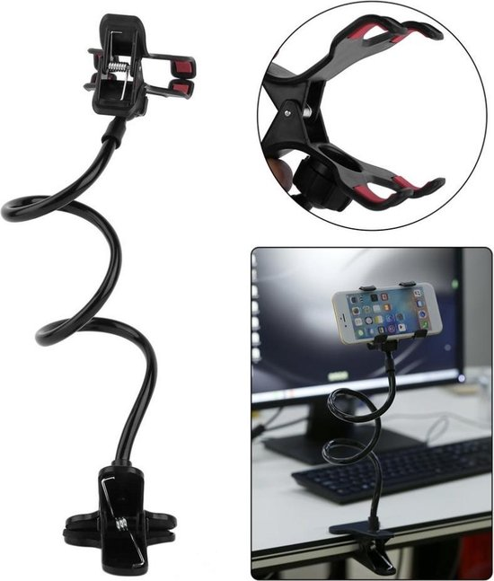

# Home Examinator Demo-version

A python/flask based online examination program using Computer Vision, currently suitable for exams made with pen and paper

### Functionality
- Uses a Flask app for the front-end interface and back-end calculations(both frond and back-end currently just run on the local computer, in the future the back-end could also be deployed to a virtual machine, with better CPU/GPU power for the models)
- Uses dlib face recognition model to recognize a person over live webcam video stream
- Uses 2 YOLOV3 object detetion model to recognize hands and smartphones
- Uses PyAudio and audioot to compare loudness in audio streams

### How to install / run the software:
1.	Install Pycharm, or another python IDE
2.	Make sure you have Python version 3.7 installed on your computer
3.	Download the IP webcam app on your phone and set ‘enable audio’ under misc to true, also notate the ip adress that the IP webcam app tells you un the screen
4.	Git clone the project into the IDE
5.	Download the latest version of chromium for your system at http://commondatastorage.googleapis.com/chromium-browser-snapshots/index.html
 and find the location of the chrome.exe executable
6.	Start pycharm as an administrator
7.	Open a terminal and type: pip install requirements.txt
8. 	In the terminal also type: pipwin install pyaudio
9.	And to run the Home Examinator type in the terminal: python app.py –-ipadress 'your ip adress'
--killchrome 'True/False' --chromium 'your path to chrome'   
(example: python app.py --ipadress 198.168.1.114 --killchrome True   --chromium C:/Users/Admin/AppData/Local/Chromium/Application/chrome.exe). **The killchrome argument can only be set to true if you actually have a chrome tab open, otherwise the bash script won't run**

### Usage
- The interface is pretty self-explanatory, but there is also a video guide, codeChallenge/guide.mp4

### Equipment:
Personally I have used a flexible phone holder attached to my desk, to get the right camera angle for the
phone video datastream

### File structure:
-   Code Challenge folder: contains all the files regarding the code challenge
-	Dataset folder: contains all face images and my Smartphone images dataset
-	Output folder: contains the encodings for the faces to recognize and an image of the exams answers
-	Static folder: contains static files for the flask webserver, css files, js files, the exam and the log file of the exam
-	Template folder: contains the webserver html template file
-	yoloColoV3 folder: contains pre-trained weights and configuration files for the Colo images dataset, from: https://pjreddie.com/darknet/yolo/
-	yoloHandsTiny folder: contains pre-trained weights and configuration files for the hand images dataset, from: https://github.com/cansik/yolo-hand-detection
-	yoloSmarthone: contains pre-trained weights and configuration files for my own Smartphone images dataset trained using the ImageAI library(I didn’t end up using this one, because of to low accuracy in testing it)
-	App.py: Flask webserver app file
-	Yolo.py: the yolo(You only look once) object detection class, takes a frame as input and returns a list of detected objects and frame with detection boxes
-	Test_audio.py: contains functions to get audio stream from the pc and phone and compare loudness of both audio streams
-	Face.py: the face recognition class, takes a frame as input and returns a list of detected faces and frame with detection boxes
-	Face_encoding.py: contains a function to train the face recognition model on newly added faces

##### This is a demo version, made as a challenge for Code University, Berlin.